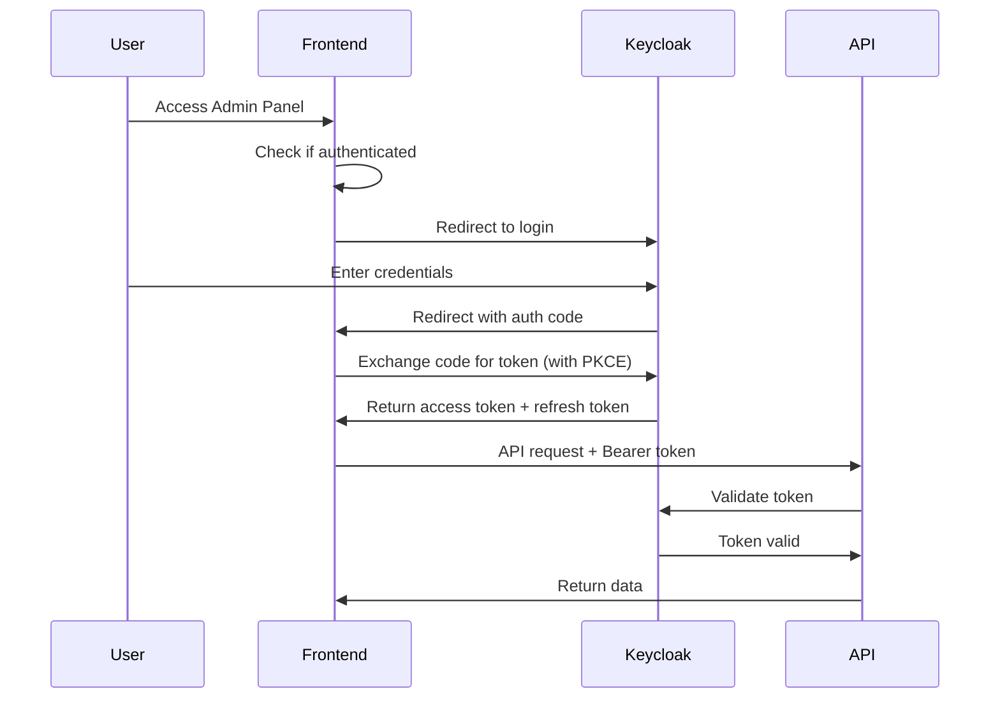

# Frontend Keycloak Integration Guide

This guide explains how to integrate Keycloak authentication with the frontend applications (Admin Panel and Public Website).

## Table of Contents
- [Overview](#overview)
- [Keycloak Configuration](#keycloak-configuration)
- [Frontend Implementation](#frontend-implementation)
- [Authentication Flow](#authentication-flow)
- [API Integration](#api-integration)
- [Code Examples](#code-examples)
- [Security Best Practices](#security-best-practices)
- [Troubleshooting](#troubleshooting)

---

## Overview

### Current Setup
- **Keycloak URL**: `http://localhost/keycloak` (external) / `http://keycloak:8080/keycloak` (internal)
- **Realm**: `taca-ua`
- **Client**: `api-client`
- **Authentication Method**: Authorization Code Flow with PKCE (recommended for SPAs)

### Architecture
```
┌─────────────────┐
│  Admin Panel    │
│  (React/Vue)    │
└────────┬────────┘
         │
         ├─────────────────────────┐
         │                         │
         ▼                         ▼
┌─────────────────┐       ┌──────────────────┐
│    Keycloak     │       │ Competition API  │
│  (Auth Server)  │       │    (Django)      │
└─────────────────┘       └──────────────────┘
         │                         ▲
         └─────────────────────────┘
           Token Validation
```

---

## Keycloak Configuration

### 1. Client Settings (Already Configured)

The client `api-client` is configured with:
- **Client ID**: `api-client`
- **Client Protocol**: `openid-connect`
- **Access Type**: `public` (for frontend) or `confidential` (for backend)
- **Valid Redirect URIs**: 
  - `http://localhost/admin/*` (Admin Panel)
  - `http://localhost/*` (Public Website)
  - Add production URLs when deploying
- **Web Origins**: `http://localhost` (adjust for production)
- **Direct Access Grants**: Enabled (for password grant - dev only)
- **Standard Flow**: Enabled (for Authorization Code Flow)

### 2. Realm Roles

Create roles in Keycloak Admin Console:
1. Navigate to: `http://localhost/keycloak/admin/`
2. Login with: `admin` / `admin`
3. Select realm: `taca-ua`
4. Go to: **Roles** → **Add Role**
5. Create roles:
   - `admin_geral` - Full access to all features
   - `admin_nucleo` - Course-specific administration
   - `user` - Basic authenticated user

### 3. User Role Assignment

Assign roles to users:
1. Go to: **Users** → Select user → **Role Mappings**
2. Select role from **Available Roles**
3. Click **Add selected**

---

## Frontend Implementation

### Option 1: Using Keycloak JavaScript Adapter (Recommended)

#### Installation

```bash
npm install keycloak-js
```

#### Setup (React Example)

**`src/auth/KeycloakProvider.tsx`**
```typescript
import Keycloak from 'keycloak-js';
import { createContext, useContext, useEffect, useState } from 'react';

// Keycloak configuration
const keycloakConfig = {
  url: 'http://localhost/keycloak',
  realm: 'taca-ua',
  clientId: 'api-client',
};

const keycloak = new Keycloak(keycloakConfig);

interface KeycloakContextType {
  keycloak: Keycloak;
  authenticated: boolean;
  loading: boolean;
  token: string | undefined;
  login: () => void;
  logout: () => void;
  hasRole: (role: string) => boolean;
}

const KeycloakContext = createContext<KeycloakContextType | null>(null);

export const KeycloakProvider: React.FC<{ children: React.ReactNode }> = ({ children }) => {
  const [authenticated, setAuthenticated] = useState(false);
  const [loading, setLoading] = useState(true);

  useEffect(() => {
    keycloak
      .init({
        onLoad: 'check-sso',
        silentCheckSsoRedirectUri: window.location.origin + '/silent-check-sso.html',
        pkceMethod: 'S256', // Enable PKCE for security
      })
      .then((auth) => {
        setAuthenticated(auth);
        setLoading(false);

        // Auto-refresh token
        if (auth) {
          setInterval(() => {
            keycloak.updateToken(70).catch(() => {
              console.error('Failed to refresh token');
            });
          }, 60000); // Check every minute
        }
      })
      .catch((error) => {
        console.error('Keycloak init failed', error);
        setLoading(false);
      });
  }, []);

  const login = () => {
    keycloak.login();
  };

  const logout = () => {
    keycloak.logout();
  };

  const hasRole = (role: string) => {
    return keycloak.hasRealmRole(role);
  };

  return (
    <KeycloakContext.Provider
      value={{
        keycloak,
        authenticated,
        loading,
        token: keycloak.token,
        login,
        logout,
        hasRole,
      }}
    >
      {children}
    </KeycloakContext.Provider>
  );
};

export const useKeycloak = () => {
  const context = useContext(KeycloakContext);
  if (!context) {
    throw new Error('useKeycloak must be used within KeycloakProvider');
  }
  return context;
};
```

#### Silent Check SSO HTML

Create `public/silent-check-sso.html`:
```html
<!DOCTYPE html>
<html>
<head>
    <title>Silent SSO Check</title>
</head>
<body>
    <script>
        parent.postMessage(location.href, location.origin);
    </script>
</body>
</html>
```

#### App Integration

**`src/App.tsx`**
```typescript
import { KeycloakProvider, useKeycloak } from './auth/KeycloakProvider';

function AppContent() {
  const { authenticated, loading, login, logout, hasRole } = useKeycloak();

  if (loading) {
    return <div>Loading...</div>;
  }

  if (!authenticated) {
    return (
      <div>
        <h1>Welcome to TACA Admin Panel</h1>
        <button onClick={login}>Login with Keycloak</button>
      </div>
    );
  }

  return (
    <div>
      <nav>
        <button onClick={logout}>Logout</button>
      </nav>
      
      {hasRole('admin_geral') && (
        <div>Admin Geral Features</div>
      )}
      
      {hasRole('admin_nucleo') && (
        <div>Admin Nucleo Features</div>
      )}
    </div>
  );
}

function App() {
  return (
    <KeycloakProvider>
      <AppContent />
    </KeycloakProvider>
  );
}

export default App;
```

### Option 2: Using OIDC Client (Alternative)

#### Installation

```bash
npm install oidc-client-ts
```

#### Configuration

```typescript
import { UserManager, WebStorageStateStore } from 'oidc-client-ts';

const oidcConfig = {
  authority: 'http://localhost/keycloak/realms/taca-ua',
  client_id: 'api-client',
  redirect_uri: 'http://localhost/admin/callback',
  post_logout_redirect_uri: 'http://localhost/admin',
  response_type: 'code',
  scope: 'openid profile email',
  userStore: new WebStorageStateStore({ store: window.localStorage }),
};

export const userManager = new UserManager(oidcConfig);
```

---

## Authentication Flow

### Authorization Code Flow with PKCE (Recommended for SPAs)



### Token Lifecycle

1. **Initial Login**: User redirected to Keycloak, receives access token (expires in 5 minutes)
2. **Token Refresh**: Before expiry, automatically refresh using refresh token
3. **Token Storage**: Store tokens in memory or sessionStorage (never localStorage for sensitive apps)
4. **Logout**: Clear tokens and redirect to Keycloak logout

---

## API Integration

### Making Authenticated Requests

#### Axios Interceptor Setup

**`src/api/client.ts`**
```typescript
import axios from 'axios';
import { useKeycloak } from '../auth/KeycloakProvider';

const apiClient = axios.create({
  baseURL: 'http://localhost/api/admin',
  headers: {
    'Content-Type': 'application/json',
  },
});

// Request interceptor - add token
export const setupInterceptors = (getToken: () => string | undefined) => {
  apiClient.interceptors.request.use(
    (config) => {
      const token = getToken();
      if (token) {
        config.headers.Authorization = `Bearer ${token}`;
      }
      return config;
    },
    (error) => Promise.reject(error)
  );

  // Response interceptor - handle 401
  apiClient.interceptors.response.use(
    (response) => response,
    (error) => {
      if (error.response?.status === 401) {
        // Token expired or invalid - redirect to login
        window.location.href = '/login';
      }
      return Promise.reject(error);
    }
  );
};

export default apiClient;
```

#### Usage in Components

```typescript
import { useEffect, useState } from 'react';
import apiClient from '../api/client';
import { useKeycloak } from '../auth/KeycloakProvider';

function CoursesPage() {
  const { token } = useKeycloak();
  const [courses, setCourses] = useState([]);

  useEffect(() => {
    const fetchCourses = async () => {
      try {
        const response = await apiClient.get('/courses', {
          headers: {
            Authorization: `Bearer ${token}`,
          },
        });
        setCourses(response.data);
      } catch (error) {
        console.error('Failed to fetch courses', error);
      }
    };

    if (token) {
      fetchCourses();
    }
  }, [token]);

  return (
    <div>
      <h1>Courses</h1>
      <ul>
        {courses.map((course) => (
          <li key={course.id}>{course.name}</li>
        ))}
      </ul>
    </div>
  );
}
```

### React Query Integration

```typescript
import { useQuery } from '@tanstack/react-query';
import { useKeycloak } from '../auth/KeycloakProvider';
import apiClient from '../api/client';

export const useCourses = () => {
  const { token } = useKeycloak();

  return useQuery({
    queryKey: ['courses'],
    queryFn: async () => {
      const response = await apiClient.get('/courses', {
        headers: { Authorization: `Bearer ${token}` },
      });
      return response.data;
    },
    enabled: !!token, // Only run if token exists
  });
};

// Usage
function CoursesPage() {
  const { data: courses, isLoading, error } = useCourses();

  if (isLoading) return <div>Loading...</div>;
  if (error) return <div>Error loading courses</div>;

  return (
    <ul>
      {courses.map((course) => (
        <li key={course.id}>{course.name}</li>
      ))}
    </ul>
  );
}
```

---

## Code Examples

### Protected Route Component

```typescript
import { Navigate } from 'react-router-dom';
import { useKeycloak } from '../auth/KeycloakProvider';

interface ProtectedRouteProps {
  children: React.ReactNode;
  requiredRole?: string;
}

export const ProtectedRoute: React.FC<ProtectedRouteProps> = ({
  children,
  requiredRole,
}) => {
  const { authenticated, loading, hasRole } = useKeycloak();

  if (loading) {
    return <div>Loading...</div>;
  }

  if (!authenticated) {
    return <Navigate to="/login" replace />;
  }

  if (requiredRole && !hasRole(requiredRole)) {
    return <Navigate to="/unauthorized" replace />;
  }

  return <>{children}</>;
};

// Usage in routes
<Routes>
  <Route path="/login" element={<LoginPage />} />
  <Route
    path="/admin"
    element={
      <ProtectedRoute requiredRole="admin_geral">
        <AdminDashboard />
      </ProtectedRoute>
    }
  />
  <Route
    path="/courses"
    element={
      <ProtectedRoute requiredRole="admin_nucleo">
        <CoursesPage />
      </ProtectedRoute>
    }
  />
</Routes>
```

### User Profile Component

```typescript
import { useKeycloak } from '../auth/KeycloakProvider';

function UserProfile() {
  const { keycloak, logout } = useKeycloak();

  const userInfo = {
    username: keycloak.tokenParsed?.preferred_username,
    email: keycloak.tokenParsed?.email,
    name: keycloak.tokenParsed?.name,
    roles: keycloak.realmAccess?.roles || [],
  };

  return (
    <div>
      <h2>User Profile</h2>
      <p>Username: {userInfo.username}</p>
      <p>Email: {userInfo.email}</p>
      <p>Name: {userInfo.name}</p>
      <p>Roles: {userInfo.roles.join(', ')}</p>
      <button onClick={logout}>Logout</button>
    </div>
  );
}
```

### Login Page

```typescript
import { useKeycloak } from '../auth/KeycloakProvider';
import { useNavigate } from 'react-router-dom';
import { useEffect } from 'react';

function LoginPage() {
  const { authenticated, login } = useKeycloak();
  const navigate = useNavigate();

  useEffect(() => {
    if (authenticated) {
      navigate('/dashboard');
    }
  }, [authenticated, navigate]);

  return (
    <div className="login-container">
      <div className="login-box">
        <h1>TACA Admin Panel</h1>
        <p>Please login to continue</p>
        <button onClick={login} className="login-button">
          Login with Keycloak
        </button>
      </div>
    </div>
  );
}
```

---

## Security Best Practices

### 1. Token Storage

**❌ Don't:**
- Store tokens in `localStorage` (vulnerable to XSS)
- Store tokens in cookies without `HttpOnly` flag

**✅ Do:**
- Store tokens in memory (React state/context)
- Use `sessionStorage` for temporary storage
- Use secure, `HttpOnly` cookies if server-side rendering

### 2. Token Validation

```typescript
// Always validate token before making requests
const isTokenValid = () => {
  if (!keycloak.token) return false;
  
  const expiresAt = keycloak.tokenParsed?.exp;
  const now = Date.now() / 1000;
  
  return expiresAt ? expiresAt > now : false;
};

// Refresh token if needed
const ensureValidToken = async () => {
  if (!isTokenValid()) {
    try {
      await keycloak.updateToken(30); // Refresh if expires in 30s
    } catch (error) {
      console.error('Token refresh failed', error);
      keycloak.login();
    }
  }
};
```

### 3. PKCE Implementation

Always use PKCE (Proof Key for Code Exchange) for SPAs:

```typescript
keycloak.init({
  pkceMethod: 'S256', // SHA-256 for PKCE
  checkLoginIframe: false, // Disable for better performance
});
```

### 4. Logout Handling

```typescript
const logout = async () => {
  // Clear local state
  localStorage.clear();
  sessionStorage.clear();
  
  // Redirect to Keycloak logout
  await keycloak.logout({
    redirectUri: window.location.origin,
  });
};
```

### 5. CORS Configuration

Ensure Nginx allows CORS for Keycloak requests:

```nginx
# In nginx.conf
location /keycloak/ {
    proxy_pass http://keycloak:8080/keycloak/;
    
    # CORS headers
    add_header 'Access-Control-Allow-Origin' '$http_origin' always;
    add_header 'Access-Control-Allow-Credentials' 'true' always;
    add_header 'Access-Control-Allow-Methods' 'GET, POST, OPTIONS' always;
    add_header 'Access-Control-Allow-Headers' 'Authorization, Content-Type' always;
    
    # Handle preflight
    if ($request_method = 'OPTIONS') {
        return 204;
    }
}
```

---

## Troubleshooting

### Common Issues

#### 1. "Invalid redirect_uri"
**Solution:** Add the redirect URI to Keycloak client configuration:
- Go to: Keycloak Admin → Clients → api-client → Settings
- Add to "Valid Redirect URIs": `http://localhost/admin/*`

#### 2. "CORS error when calling Keycloak"
**Solution:** 
- Verify `Web Origins` in Keycloak client settings includes `http://localhost`
- Check Nginx CORS configuration (see above)

#### 3. "Token validation fails on API"
**Solution:**
- Ensure Competition API has Keycloak configuration:
  ```python
  KEYCLOAK_CONFIG = {
      'KEYCLOAK_SERVER_URL': 'http://keycloak:8080/keycloak',
      'KEYCLOAK_REALM': 'taca-ua',
  }
  ```
- Verify token is sent in `Authorization: Bearer <token>` header

#### 4. "Token expires too quickly"
**Solution:** Adjust token lifespan in Keycloak:
- Realm Settings → Tokens → Access Token Lifespan (default: 5 min)
- Increase to 15-30 minutes for development
- Implement auto-refresh in frontend

#### 5. "Silent SSO not working"
**Solution:**
- Ensure `silent-check-sso.html` exists in `public/` directory
- Verify URL in `silentCheckSsoRedirectUri` is correct
- Check browser console for errors

### Debug Mode

Enable Keycloak debug logging:

```typescript
keycloak.init({
  onLoad: 'check-sso',
  pkceMethod: 'S256',
  enableLogging: true, // Enable debug logs
});

// Monitor events
keycloak.onTokenExpired = () => {
  console.log('Token expired, refreshing...');
  keycloak.updateToken(30);
};

keycloak.onAuthSuccess = () => {
  console.log('Authentication successful');
};

keycloak.onAuthError = (error) => {
  console.error('Authentication error', error);
};
```

### Testing Credentials

**Keycloak Admin:**
- URL: `http://localhost/keycloak/admin/`
- Username: `admin`
- Password: `admin`

**Test User:**
- Username: `testuser`
- Password: `testpass123`
- Realm: `taca-ua`

---

## Environment Variables

Create `.env` file in frontend project:

```bash
# Development
VITE_KEYCLOAK_URL=http://localhost/keycloak
VITE_KEYCLOAK_REALM=taca-ua
VITE_KEYCLOAK_CLIENT_ID=api-client
VITE_API_BASE_URL=http://localhost/api/admin

# Production (update when deploying)
# VITE_KEYCLOAK_URL=https://your-domain.com/keycloak
# VITE_KEYCLOAK_REALM=taca-ua
# VITE_KEYCLOAK_CLIENT_ID=api-client
# VITE_API_BASE_URL=https://your-domain.com/api/admin
```

Use in code:

```typescript
const keycloakConfig = {
  url: import.meta.env.VITE_KEYCLOAK_URL,
  realm: import.meta.env.VITE_KEYCLOAK_REALM,
  clientId: import.meta.env.VITE_KEYCLOAK_CLIENT_ID,
};
```

---

## Next Steps

1. **Install Dependencies:**
   ```bash
   npm install keycloak-js axios @tanstack/react-query
   ```

2. **Implement KeycloakProvider** (see code above)

3. **Setup API Client** with interceptors

4. **Create Protected Routes** for admin features

5. **Test Authentication Flow:**
   - Login → Get token → Call API → Refresh token → Logout

6. **Configure Production:** Update URLs and create production client in Keycloak

---

## Additional Resources

- [Keycloak JS Adapter Documentation](https://www.keycloak.org/docs/latest/securing_apps/#_javascript_adapter)
- [OIDC Standard](https://openid.net/connect/)
- [PKCE RFC](https://tools.ietf.org/html/rfc7636)
- [React Router Auth Example](https://reactrouter.com/docs/en/v6/examples/auth)

---

## Support

For issues or questions:
1. Check Keycloak logs: `docker logs taca-ua-app-keycloak-1`
2. Check frontend browser console
3. Verify Keycloak configuration in Admin Console
4. Test token endpoint manually: 
   ```bash
   curl -X POST http://localhost/keycloak/realms/taca-ua/protocol/openid-connect/token \
     -d "client_id=api-client" \
     -d "username=testuser" \
     -d "password=testpass123" \
     -d "grant_type=password"
   ```
