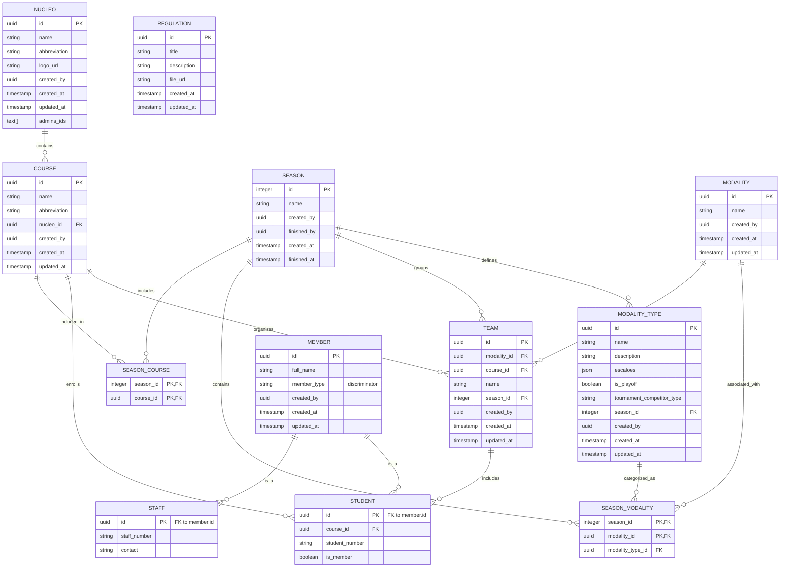

# Modalities Service

Microservice for managing modalities, courses, teams, staff, and students within the TACA-UA platform.

## Domain Models

### Entity Relationship Diagram



### Core Entities

#### **Nucleo**
Represents an academic nucleus (organizational unit). Admin boundaries for course management.
- `id`: UUID
- `name`: Display name
- `abbreviation`: Unique identifier
- `logo_url`: Optional logo URL
- `created_by`: User who created the nucleus
- `admins_ids`: Array of user IDs with admin access

#### **Course**
Academic course within a nucleus.
- `id`: UUID
- `name`: Course name
- `abbreviation`: Unique code
- `nucleo_id`: Parent nucleus
- `created_by`: Creator user ID

#### **Season**
Sports season grouping modality competitions.
- `id`: Integer (auto-increment)
- `name`: Season identifier
- `created_by`: Creator user ID
- `finished_by`: User who finalized the season
- `finished_at`: Completion timestamp

#### **ModalityType**
Sport category definition within a season.
- `id`: UUID
- `name`: Sport type (e.g., "Football", "Volleyball")
- `escaloes`: JSON array of participation tiers with participant ranges and points
- `is_playoff`: Boolean flag for playoff modalities
- `tournament_competitor_type`: "individual" or "team"
- `season_id`: Associated season

#### **Modality**
Represents a modality (instance of a sport).
- `id`: UUID
- `name`: Modality name
- Links to a `ModalityType` via `SeasonModality`

#### **Member** (Base Class)
Polymorphic base for people in the system.
- `id`: UUID
- `full_name`: Person's full name
- `member_type`: Discriminator ("student" or "staff")

#### **Student** (extends Member)
Represents a student enrolled in a course.
- `course_id`: Enrolled course
- `student_number`: Unique student identifier
- `is_member`: Athletic association membership status
- Many-to-many relationship with `Team` via `team_players`

#### **Staff** (extends Member)
Represents staff members.
- `staff_number`: Unique staff identifier
- `contact`: Contact information

#### **Team**
Sports team for a modality within a course/season.
- `id`: UUID
- `name`: Team name
- `modality_id`: Sport modality
- `course_id`: Home course
- `season_id`: Associated season
- Many-to-many relationship with `Student` (players)

#### **SeasonModality**
Association linking Season, Modality, and ModalityType.
- `season_id`: Foreign key to Season
- `modality_id`: Foreign key to Modality
- `modality_type_id`: Foreign key to ModalityType

#### **Regulation**
Sports regulation documents.
- `id`: UUID
- `title`: Document title
- `description`: Optional description
- `file_url`: URL to regulation file

---

## Events Produced

The service emits domain events via RabbitMQ using the Outbox pattern for consistency. All events follow event sourcing principles.

### Modality Events

| Event | Trigger | Payload |
|-------|---------|---------|
| `modality.created.v1` | Create modality | `modality_id`, `name`, `modality_type_id` |
| `modality.updated.v1` | Update modality | `modality_id`, `name`, `modality_type_id` |
| `modality.deleted.v1` | Delete modality | `modality_id` |

### Team Events

| Event | Trigger | Payload |
|-------|---------|---------|
| `team.created.v1` | Create team | `team_id`, `name`, `modality_id`, `course_id` |
| `team.updated.v1` | Update team | `team_id`, `name`, `modality_id`, `course_id` |
| `team.deleted.v1` | Delete team | `team_id` |
| `team.player_added.v1` | Add student to team | `team_id`, `student_id` |
| `team.player_removed.v1` | Remove student from team | `team_id`, `student_id` |

### Student Events

| Event | Trigger | Payload |
|-------|---------|---------|
| `student.created.v1` | Create student | `student_id`, `full_name`, `course_id`, `student_number`, `is_member` |
| `student.updated.v1` | Update student | `student_id`, `full_name`, `is_member` |
| `student.deleted.v1` | Delete student | `student_id` |

### Staff Events

| Event | Trigger | Payload |
|-------|---------|---------|
| `staff.created.v1` | Create staff | `staff_id`, `full_name`, `staff_number`, `contact` |
| `staff.updated.v1` | Update staff | `staff_id`, `full_name`, `staff_number`, `contact` |
| `staff.deleted.v1` | Delete staff | `staff_id` |

### Course Events

| Event | Trigger | Payload |
|-------|---------|---------|
| `course.created.v1` | Create course | `course_id`, `name`, `abbreviation`, `nucleo_id` |
| `course.updated.v1` | Update course | `course_id`, `name`, `abbreviation` |
| `course.deleted.v1` | Delete course | `course_id` |

### Nucleo Events

| Event | Trigger | Payload |
|-------|---------|---------|
| `nucleo.created.v1` | Create nucleo | `nucleo_id`, `name`, `abbreviation`, `logo_url`, `admins_ids` |
| `nucleo.updated.v1` | Update nucleo | `nucleo_id`, `name`, `abbreviation`, `logo_url`, `admins_ids` |
| `nucleo.deleted.v1` | Delete nucleo | `nucleo_id` |

### ModalityType Events

| Event | Trigger | Payload |
|-------|---------|---------|
| `modality_type.created.v1` | Create modality type | `modality_type_id`, `name`, `description`, `escaloes`, `is_playoff`, `tournament_competitor_type` |
| `modality_type.updated.v1` | Update modality type | Same fields as created |
| `modality_type.deleted.v1` | Delete modality type | `modality_type_id` |

### Regulation Events

| Event | Trigger | Payload |
|-------|---------|---------|
| `regulation.created.v1` | Create regulation | `regulation_id`, `title`, `description`, `file_url` |
| `regulation.updated.v1` | Update regulation | Same fields as created |
| `regulation.deleted.v1` | Delete regulation | `regulation_id` |

---

## Snapshots Produced

The service generates read model snapshots for all entities to support eventual consistency patterns across the platform.

### Snapshot Models

| Entity | Snapshot Type | Fields |
|--------|---------------|--------|
| **Nucleo** | `NucleoSnapshotItem` | `id`, `name`, `abbreviation`, `logo_url`, `created_by`, `created_at`, `updated_at`, `admins_ids` |
| **Course** | `CourseSnapshotItem` | `id`, `name`, `abbreviation`, `nucleo_id`, `created_by`, `created_at`, `updated_at` |
| **Student** | `StudentSnapshotItem` | `id`, `full_name`, `course_id`, `student_number`, `is_member`, `created_by`, `created_at`, `updated_at` |
| **Staff** | `StaffSnapshotItem` | `id`, `full_name`, `staff_number`, `contact`, `created_by`, `created_at`, `updated_at` |
| **Team** | `TeamSnapshotItem` | `id`, `modality_id`, `course_id`, `name`, `players` (list of student IDs), `created_by`, `created_at`, `updated_at` |
| **Modality** | `ModalitySnapshotItem` | `id`, `name`, `modality_type_id`, `created_by`, `created_at`, `updated_at` |
| **ModalityType** | `ModalityTypeSnapshotItem` | `id`, `name`, `description`, `escaloes` (structured list), `created_by`, `created_at`, `updated_at` |
| **Regulation** | `RegulationSnapshotItem` | `id`, `title`, `description`, `file_url`, `created_at` |

### Snapshot Generation

Each domain model implements a `to_snapshot()` method that converts the ORM entity to its corresponding snapshot model. Snapshots are created automatically:

- **On every state change**: Created alongside domain events for consistency
- **Used by**: Read Model Updater service to maintain materialized views
- **Storage**: Embedded in outbox events for reliable event publication

Example:
```python
team = db.query(Team).first()
snapshot = team.to_snapshot()  # Returns TeamSnapshotItem
```

---

## Database Schema

- **Schema Name**: `modalities`
- **Database**: PostgreSQL with UUID and ARRAY support
- **Migrations**: Alembic-managed (see `alembic/versions/` directory)

---

## Event Publishing

The service uses the **Outbox Pattern** for reliable event publishing:

1. **Transactional Consistency**: Domain changes and event creation within same transaction
2. **Reliable Delivery**: OutboxPublisher polls and publishes events to RabbitMQ
3. **Event Schema**: `taca_events.pydantic_schemas.modalities` (from shared contracts)

---

## Development

See [DEV_SETUP.md](../../docs/DEV_SETUP.md) for local development environment setup.
